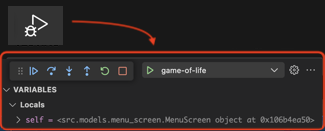
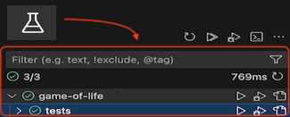
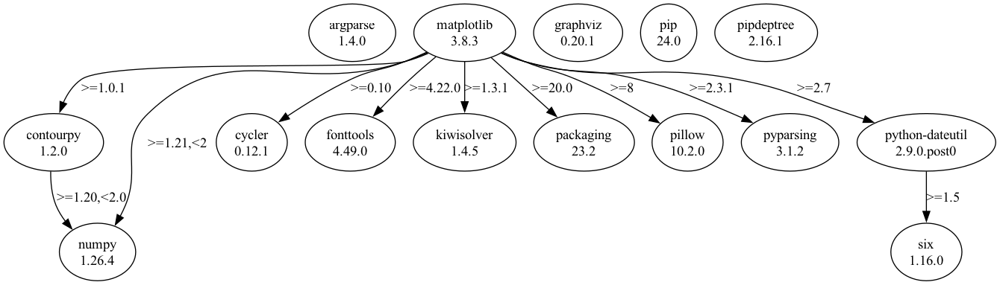

<div align="center">
  <h1> Game of Life</h1>
  <p>Simulate life itself</p>
    
</div>

## 🔌 How do I run it?

1. Assumes you have [asdf](./.tool-versions) installed (last using Python 3.13.5)
2. Run in [root](.):
   ```shell
   python3 -m venv venv
   source venv/bin/activate
   pip install -r requirements.txt
   ./game-of-life.py
   ```
3. Script may require execution permissions: `chmod u+x game-of-life.py`


## 🎮 How do I play?
```
(\(\
( . .) ...so how do I play ?
(づ🎮⊂)
```

### Settings via CLI args
- See `./game-of-life -h`

### Settings via TUI main menu?
- Use <kbd>↑</kbd> <kbd>↓</kbd> to navigate through settings (current item = selected)
- For value settings: Just start typing and press <kbd>delete</kbd> to clear your input or <kbd>enter</kbd> to save your input
- For option settings: Cycle through choices using <kbd>←</kbd> <kbd>→</kbd> and press <kbd>enter</kbd> to save 
- Press <kbd>tab</kbd> <kbd>tab</kbd> to reset to default settings
- Press <kbd>space</kbd> <kbd>space</kbd> to start
- Press <kbd>Ctrl</kbd> <kbd>C</kbd> to exit

## ❓ FAQ

### _"There are GIFs?"_

When the game ends, a GIF of the run is generated and saved in [./gifs](./gifs/).

### _"How do I debug?"_

Use VS Code + Python Extension:  


### _"How do I run unit tests?"_

Use VS Code + Python Extension:  


### _"How do I regenerate the dependency graph?"_

```shell
pipdeptree --graph-output png > dependencies.png
```

## 🕸️ Dependency Graph



- _curses_ for pretty screens + key events
- _numpy_ for merging multiple cell matrices (for ghost effect)
- _argparse_ for CLI args support
- _matplotlib_ + _pillow_ for creating GIF outputs
