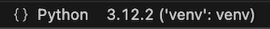
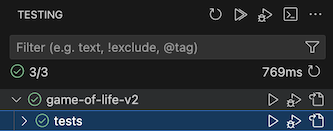

<div align="center">
  <h1>Game of Life</h1>
  <p>Speedrun Rewriting an Old Uni Project</p>
    
</div>

## 🔌 How do I run it?

1. assuming you have **asdf** installed
2. `python -m venv venv`
3. `source ./venv/bin/activate`
4. `pip install -r requirements.txt`
5. `python ./src/app`  
   OR  
   `./game-of-life.py` (requires execution perms: `chmod u+x game-of-life.py`)

## 📋 How do I use it?

```
(\(\
( . .) so how do I play ?
(づ🎮⊂)
```

- Settings can be passed via CLI args, see `./game-of-life -h`
- Initial settings are applied from CLI
- You can modify/reset to defaults in the main menu
- <kbd>↑</kbd> <kbd>↓</kbd> to navigate through settings
- Start typing to set new input for selected setting
- <kbd>←</kbd> <kbd>→</kbd> to cycle through fixed setting options
- <kbd>delete</kbd> to clear the input
- <kbd>enter</kbd> to save the input
- <kbd>tab</kbd> <kbd>tab</kbd> to reset
- <kbd>space</kbd> <kbd>space</kbd> to start
- <kbd>Ctrl</kbd> <kbd>C</kbd> to exit
- GIFs are saved in _./gifs_

## Dev notes

### _How do I debug ?_

- Use VSCode:

  

  

### _How do I run unit tests ?_

- Use VSCode:

  

### _How do I regen the dependency graph ?_

- Run `pipdeptree --graph-output png > dependencies.png`

## Dependency Graph


- _curses_ for pretty screens + key events
- _numpy_ for merging multiple cell matrices (for ghost effect)
- _argparse_ for CLI args support
- _matplotlib_ + _pillow_ for creating GIF outputs
